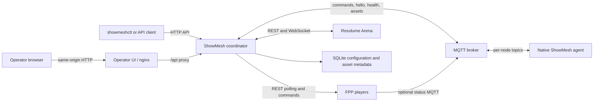

ShowMesh keeps management separate from show playback. The coordinator can fail or become unreachable without entering the media path of an already-running device.

## Read current status

The API reports provenance and freshness with observations. A value can be current, stale, unavailable because collection failed, unsupported, or of unknown age. `unknown_age` commonly means the coordinator restored retained MQTT evidence whose original observation time is not known; it is never treated as fresh.

## Control flow

FPP and Resolume writes are evidence-confirmed: ShowMesh sends a bounded primitive and waits for the observed state to match. A timeout means ShowMesh could not confirm the requested result. It does not safely prove that the device ignored the command, so check the device before retrying.

Macros are asynchronous runs composed from logical actions. Submitting a run returns before all steps finish unless the client follows the run. Runs normally continue after a failed step. A step configured with `onFailure: abort` skips the remainder after failure; `onUnconfirmed: abort` does the same after an unconfirmed result. The completed run records every attempted or skipped outcome.

## Media-node runtime path

Surface objects describe geometry, channel ranges, node assignment, and an `ndi` or `hdmi` transport. The experimental render-node runtime consumes an applied NDI surface and node-local FSEQ asset. See [Render nodes](../../using-showmesh/node-types/render-nodes/) for the supported configuration.

The separate [audio-node](../../using-showmesh/node-types/audio-nodes/) role provides experimental playback and LTC paths. Both roles build on the same native agent and advertise composable capabilities rather than belonging to a hardcoded node class. An installation can declare more than one `audio.node`, each with a role (`program`, `program+ltc`, or `zone`). Cue audio, announcements, and Night beds can target several nodes; the coordinator prepares them and chooses one shared media-clock instant. LTC remains a one-node output. Every target reports aligned or unaligned evidence rather than letting request acceptance stand in for synchronization.

`node.clock` declares the managed, external, or FPP-provided PTP relationship for a node. Static output-latency calibration can compensate for a measured output-chain delay.

## Show operation and safety

An installation-wide operating mode (`program` or `show`) and a show-scoped Emergency Stop surface are implemented at the coordinator's API, UI, and CLI. Emergency Stop is not gated by mode and concurrently stops FPP, silences declared audio nodes, and blackouts configured Resolume instances. Show Night session objects and lifecycle commands are also implemented.

:::note[Experimental media paths]
HDMI output and coordinator-to-node execution of signed FPP fallback entries are not available. Test physical audio, LTC, NDI, and timing behavior on the equipment used for the show.
:::
