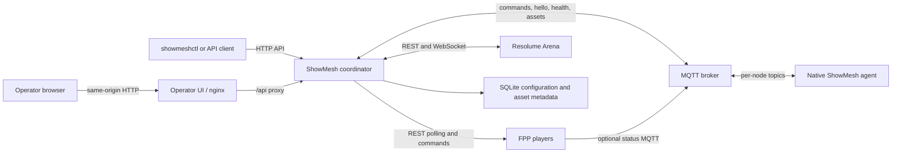

ShowMesh keeps the management plane separate from show playback. The coordinator can fail or become unreachable without being placed in the media path of an already-running device.

## Evidence, not guesses

The API reports provenance and freshness with observations. A value can be current, stale, unavailable because collection failed, unsupported, or of unknown age. `unknown_age` commonly means the coordinator restored retained MQTT evidence whose original observation time is not known; it is never treated as fresh.

## Control flow

FPP and Resolume writes are evidence-confirmed: ShowMesh sends a bounded primitive and waits for the observed state to match. A timeout means ShowMesh could not confirm the requested result. It does not safely prove that the device ignored the command, so check the device before retrying.

Macros are asynchronous runs composed from logical actions. Submitting a run returns before all steps finish unless the client follows the run. Runs normally continue after a failed step. A step configured with `onFailure: abort` skips the remainder after failure; `onUnconfirmed: abort` does the same after an unconfirmed result. The completed run records every attempted or skipped outcome.

## Media-node runtime path

Surface objects describe geometry, channel ranges, node assignment, and an `ndi` or `hdmi` transport. Current `main` includes an experimental render-node runtime that consumes an applied NDI surface and node-local FSEQ asset. HDMI has no runtime output path. See the [render-node](../../using-showmesh/node-types/render-nodes/) page for the operating boundary.

The separate [audio-node](../../using-showmesh/node-types/audio-nodes/) role provides experimental playback and LTC paths. Both roles build on the same native agent and advertise composable capabilities rather than belonging to a hardcoded node class. An installation can declare more than one `audio.node`, each with a role (`program`, `program+ltc`, or `zone`), but no installation has run with more than one audio node.

## Show operation and safety

An installation-wide operating mode (`program` or `show`) and a show-scoped emergency-stop command surface are implemented at the coordinator's API and CLI. Emergency stop is not gated by mode: no mode may refuse, delay, or degrade blackout, stop, or power-off. Show Night session objects and their lifecycle commands (preparation, readiness, pre-show, start, fade-out, power-down) are also implemented. Signed FPP fallback programs are stored and served by the coordinator; the FPP-host component that would execute one lives in the separate `showmesh-fpp-plugin` repository and has not been installed on a real FPP host.
