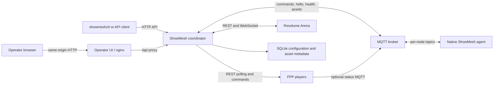

ShowMesh keeps the management plane separate from show playback. The coordinator can fail or become unreachable without being placed in the media path of an already-running device.

## Evidence, not guesses

The API reports provenance and freshness with observations. A value can be current, stale, unavailable because collection failed, unsupported, or of unknown age. `unknown_age` commonly means the coordinator restored retained MQTT evidence whose original observation time is not known; it is never treated as fresh.

## Control flow

FPP and Resolume writes are evidence-confirmed: ShowMesh sends a bounded primitive and waits for the observed state to match. A timeout means ShowMesh could not confirm the requested result. It does not safely prove that the device ignored the command, so check the device before retrying.

Macros are asynchronous runs composed from logical actions. Submitting a run returns before all steps finish unless the client follows the run. Runs normally continue after a failed step. A step configured with `onFailure: abort` skips the remainder after failure; `onUnconfirmed: abort` does the same after an unconfirmed result. The completed run records every attempted or skipped outcome.

## Planned runtime path

Surface objects can describe geometry, channel ranges, node assignment, and an `ndi` or `hdmi` transport. No current runtime consumes those objects to render pixels or produce either output. Treat the surface model as configuration available for authoring and inspection, not a working media path.
