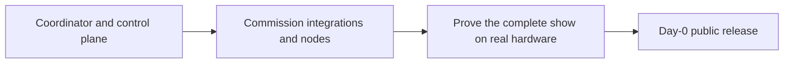

import { Card, CardGrid } from '@astrojs/starlight/components';
import StatusBadge from '../../../components/StatusBadge.astro';
import StatusNote from '../../../components/StatusNote.astro';

ShowMesh is being assembled around a simple standard: a show should keep running when a control-plane component, UI, integration, or media path has trouble. This roadmap separates code that is present from capability that has been observed on the equipment it is meant to operate.

Planned work and future evidence gates are identified below. They are not available operating capability until the named implementation and verification boundary is complete.

<StatusNote status="experimental-active" label="No public release date yet">

There are no published release images or a compatibility promise yet. The current source build is for deliberate, isolated show-network evaluation—not an unattended production install.

</StatusNote>

## What is usable in the current development build

<CardGrid>
  <Card title="Coordinator and operator controls" icon="rocket">
    Source-built Compose deployment, authenticated MQTT, inventory, observations, API, CLI, Operator UI, principals, audit, backups, and explicit recovery paths. [Install the coordinator →](/getting-started/installation/)
  </Card>
  <Card title="FPP control and observation" icon="puzzle">
    FPP REST/MQTT observation, evidence-confirmed playlist and volume controls, actions, macros, assets, shows, and surfaces. FPP remains the scheduler. [Configure FPP →](/integrations/fpp/)
  </Card>
  <Card title="Resolume Arena control" icon="seti">
    One Arena instance, composition identity import, observation, supported named actions, and recovery controls. Arena continues to own its composition and mapping. [Configure Arena →](/integrations/resolume/)
  </Card>
</CardGrid>

## The next evidence gates

<CardGrid>
  <Card title="Render node and NDI" icon="image">
    <StatusBadge status="experimental-testing" />

    The Debian 13 amd64 sender path is built and has transport evidence. The complete FSEQ → MultiSync → NDI → Resolume → wall path still needs timing, pacing, recovery, and real-installation evidence. [Commission a video node →](/guides/set-up-a-video-node/)
  </Card>
  <Card title="Audio node" icon="warning">
    <StatusBadge status="planned" label="Planned — do not deploy" />

    The intended audio authority and safety boundaries are documented, but ShowMesh has no supported sound-producing installation path or commissioned hardware workflow. [Read the audio preview →](/guides/set-up-an-audio-node/)
  </Card>
  <Card title="Night-session operation" icon="open-book">
    The night-session operating path and public operator guide are not available. They remain day-0 work and require real-installation observation before publication.
  </Card>
</CardGrid>

## Day-0 public release work

The first public release needs more than source code. It needs an installation people can reproduce and a safe answer when something is missing. The tracked day-0 documentation work covers:

- the recorded Debian NDI plugin build recipe and tested runtime versions;
- Resolume screenshots and per-version setup notes;
- real-installation render, NDI, FPP, and recovery evidence;
- an audio guide only after the implementation lands and hardware commissioning proves its routing, LTC alignment, and failure behavior;
- secure remote/TLS deployment, backup/restore drills, compatibility policy, and FPP/xLights commissioning guidance;
- the night-session operator procedure after the complete loop has been observed on real hardware.

Until those gates close, use the current guides to stage and test a show deliberately, and retain native/manual controls for every show-critical system.

## How to read a maturity label

<StatusBadge status="experimental-active" /> means code is present on current `main` but remains under active development.

<StatusBadge status="experimental-testing" /> means the feature has a defined test path and some evidence, but still requires real-system validation before it is relied on.

<StatusBadge status="planned" /> means the behavior is design intent, not an available operating capability.
