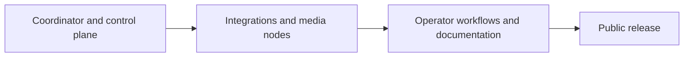

import { Card, CardGrid } from '@astrojs/starlight/components';
import StatusBadge from '../../../components/StatusBadge.astro';
import StatusNote from '../../../components/StatusNote.astro';

ShowMesh is being built so a show can keep running when a coordinator, UI, integration, or media path has trouble. This page separates usable features, active development, and work planned next.

For the meaning of Available, Experimental, and Planned labels, see [Maturity and complexity](../maturity/).

<StatusNote status="experimental-active" label="No public release date yet">

Tag-driven release automation and artifact definitions exist, but public availability and the compatibility promise must be checked against the selected release. Development builds remain for deliberate, isolated show-network evaluation, not unattended production use.

</StatusNote>

## Available now

<CardGrid>
  <Card title="Coordinator and operator controls" icon="rocket">
    Source-built Compose deployment, authenticated MQTT, inventory, observations, API, CLI, Operator UI, principals, audit, backups, and explicit recovery paths. [Install the coordinator →](/getting-started/installation/)
  </Card>
  <Card title="FPP control and observation" icon="puzzle">
    FPP REST/MQTT observation, evidence-confirmed playlist and volume controls, imported playlist definitions, readiness, actions, macros, assets, Shows, Cues, and Playlists. FPP remains the scheduler. [Configure FPP →](/integrations/fpp/)
  </Card>
  <Card title="Resolume Arena control" icon="desktop">
    One Arena instance, composition identity import, observation, supported named actions, and recovery controls. Arena continues to own its composition and mapping. [Configure Arena →](/integrations/resolume/)
  </Card>
  <Card title="Show Mode and emergency stop" icon="warning">
    One installation-wide Program Mode/Show Mode value that subsystems read and react to, and an emergency-stop action every operator surface can reach. [Read Show Mode →](/using-showmesh/show-mode/)
  </Card>
  <Card title="Node installer" icon="setting">
    A scripted native-node install for a Debian 13 host, including systemd unit installation and preflight checks. [Install a native node →](/guides/add-a-node/)
  </Card>
  <Card title="Show authoring and operation" icon="open-book">
    Shows, Cues, Playlists, media playlists, assets, actions, macros, current runs, readiness checks, and the Show Night lifecycle are available through the API, CLI, and Operator UI. [Build a show →](/guides/author-a-show/)
  </Card>
</CardGrid>

## In development

These paths work in the documented build and are being extended or hardened. Their interfaces and operating requirements can still change.

<CardGrid>
  <Card title="Render node and NDI" icon="server">
    <StatusBadge status="experimental-testing" />

    Native render nodes follow the FPP timeline, read node-local FSEQ content, and publish NDI. The current runtime supports one active surface per node; HDMI output is not available. [Set up a video node →](/guides/set-up-a-video-node/)
  </Card>
  <Card title="Audio node" icon="warning">
    <StatusBadge status="experimental-testing" />

    Audio nodes provide local playback, PipeWire routing, PTP-backed scheduling, output-latency calibration, LTC generation, and retained alignment measurements. [Read about audio nodes →](/using-showmesh/node-types/audio-nodes/)
  </Card>
  <Card title="Show Night" icon="open-book">
    <StatusBadge status="experimental-active" />

    Show Night brings together a Show, FPP Playlists, multi-node background audio, Transition Steps, readiness checks, and a controlled start/end lifecycle. [Read Show Night →](/using-showmesh/show-night/)
  </Card>
  <Card title="FPP Connect" icon="setting">
    <StatusBadge status="experimental-testing" />

    Native nodes accept experimental xLights FPP Connect content and report channel-range outcomes. [Read the FPP Connect guide →](/integrations/xlights/)
  </Card>
  <Card title="Multi-node audio" icon="warning">
    <StatusBadge status="experimental-active" />

    Cue audio, announcements, Night beds, item changes, and resumes can target several nodes at one shared scheduled instant. Per-node status reports whether each target used that instant. [Set up an audio node →](/guides/set-up-an-audio-node/)
  </Card>
  <Card title="Audio asset delivery" icon="server">
    <StatusBadge status="experimental-active" />

    The asset path is being extended to normalize uploaded audio for playback, reuse bytes already held on a node, and preserve valid filenames that share the same content. [Read about assets →](/using-showmesh/assets/)
  </Card>
  <Card title="Signed FPP fallback program" icon="puzzle">
    <StatusBadge status="experimental-active" />

    The coordinator builds and signs fallback programs, and the plugin can fetch, verify, install, acknowledge, and locally resolve entries. Activation delivery and node execution are still being built. [Read about FPP →](/integrations/fpp/)
  </Card>
</CardGrid>

## Up next

These items have not started as supported public paths:

- **Published release installation:** publish the coordinator images and native-agent packages, then document one reproducible install and upgrade path.
- **Packaged FPP plugin:** provide a supported FPP installation path after activation delivery and node execution are complete.
- **Supported media-node profiles:** publish known-good NDI, audio, PTP, and LTC combinations after testing the complete path on the target hardware.
- **Secure remote access:** document TLS termination, remote administration, backup, restore, and recovery for installations that extend beyond an isolated show network.
- **Versioned compatibility:** define the release compatibility policy and publish documentation for released versions.

Use the current guides to stage and test a show deliberately, and retain native controls for every show-critical system.
