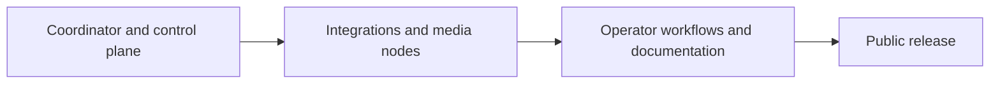

import { Card, CardGrid } from '@astrojs/starlight/components';
import StatusBadge from '../../../components/StatusBadge.astro';
import StatusNote from '../../../components/StatusNote.astro';

ShowMesh is being built so a show can keep running when a control-plane component, UI, integration, or media path has trouble. This page separates usable development features from work that is still in progress.

For the meaning of Available, Experimental, and Planned labels, see [Maturity and complexity](../maturity/).

<StatusNote status="experimental-active" label="No public release date yet">

There are no published release images or a compatibility promise yet. The current source build is for deliberate, isolated show-network evaluation—not an unattended production install.

</StatusNote>

## What is usable in the current development build

<CardGrid>
  <Card title="Coordinator and operator controls" icon="rocket">
    Source-built Compose deployment, authenticated MQTT, inventory, observations, API, CLI, Operator UI, principals, audit, backups, and explicit recovery paths. [Install the coordinator →](/getting-started/installation/)
  </Card>
  <Card title="FPP control and observation" icon="puzzle">
    FPP REST/MQTT observation, evidence-confirmed playlist and volume controls, imported playlist definitions, readiness, actions, macros, assets, Shows, Cues, and Playlists. FPP remains the scheduler. [Configure FPP →](/integrations/fpp/)
  </Card>
  <Card title="Resolume Arena control" icon="desktop">
    One Arena instance, composition identity import, observation, supported named actions, and recovery controls. Arena continues to own its composition and mapping. [Configure Arena →](/integrations/resolume/)
  </Card>
</CardGrid>

## What is next

<CardGrid>
  <Card title="Render node and NDI" icon="server">
    <StatusBadge status="experimental-testing" />

    Native render nodes follow the FPP timeline, read node-local FSEQ content, and publish NDI. The current runtime supports one active surface per node; HDMI output is not available. [Set up a video node →](/guides/set-up-a-video-node/)
  </Card>
  <Card title="Audio node" icon="warning">
    <StatusBadge status="experimental-testing" label="Experimental — do not deploy" />

    Audio-node software covers configuration, session control, gain/output control, and LTC generation. [Read about audio nodes →](/using-showmesh/node-types/audio-nodes/)
  </Card>
  <Card title="Show Night" icon="open-book">
    Show Night brings together a Show, FPP Playlists, background audio, Transition Steps, and a controlled start/end lifecycle. [Read Show Night →](/using-showmesh/show-night/)
  </Card>
  <Card title="FPP Connect" icon="setting">
    Native nodes accept experimental xLights FPP Connect content and report channel-range outcomes. [Read the FPP Connect guide →](/integrations/xlights/)
  </Card>
</CardGrid>

## Day-0 public release work

The first public release needs more than source code. It needs an installation people can reproduce and a safe answer when something is missing. Remaining work includes:

- the recorded Debian NDI plugin build recipe and tested runtime versions;
- Resolume screenshots and per-version setup notes;
- a supported audio installation guide with clear routing, LTC alignment, and failure guidance;
- secure remote/TLS deployment, backup/restore drills, compatibility policy, and FPP/xLights setup guidance;
- continued refinement of Show Night and operator workflows as the UI work lands.

Use the current guides to stage and test a show deliberately, and retain native/manual controls for every show-critical system.
