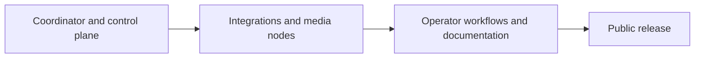

import { Card, CardGrid } from '@astrojs/starlight/components';
import StatusBadge from '../../../components/StatusBadge.astro';
import StatusNote from '../../../components/StatusNote.astro';

ShowMesh is being built so a show can keep running when a control-plane component, UI, integration, or media path has trouble. This page separates usable development features from work that is still in progress.

For the meaning of Available, Experimental, and Planned labels, see [Maturity and complexity](../maturity/).

<StatusNote status="experimental-active" label="No public release date yet">

Tag-driven release automation and artifact definitions exist, but public availability and the compatibility promise must be checked against the selected release. Development builds remain for deliberate, isolated show-network evaluation, not unattended production use.

</StatusNote>

## What is usable in the current development build

<CardGrid>
  <Card title="Coordinator and operator controls" icon="rocket">
    Source-built Compose deployment, authenticated MQTT, inventory, observations, API, CLI, Operator UI, principals, audit, backups, and explicit recovery paths. [Install the coordinator →](/getting-started/installation/)
  </Card>
  <Card title="FPP control and observation" icon="puzzle">
    FPP REST/MQTT observation, evidence-confirmed playlist and volume controls, imported playlist definitions, readiness, actions, macros, assets, Shows, Cues, and Playlists. FPP remains the scheduler. [Configure FPP →](/integrations/fpp/)
  </Card>
  <Card title="Resolume Arena control" icon="desktop">
    One Arena instance, composition identity import, observation, supported named actions, and recovery controls. Arena continues to own its composition and mapping. [Configure Arena →](/integrations/resolume/)
  </Card>
  <Card title="Show Mode and emergency stop" icon="warning">
    One installation-wide Program Mode/Show Mode value that subsystems read and react to, and an emergency-stop action every operator surface can reach. [Read Show Mode →](/using-showmesh/show-mode/)
  </Card>
  <Card title="Node installer" icon="setting">
    A scripted native-node install for a Debian 13 host, including systemd unit installation and preflight checks. [Install a native node →](/guides/add-a-node/)
  </Card>
</CardGrid>

## What is next

<CardGrid>
  <Card title="Render node and NDI" icon="server">
    <StatusBadge status="experimental-testing" />

    Native render nodes follow the FPP timeline, read node-local FSEQ content, and publish NDI. The current runtime supports one active surface per node; HDMI output is not available. [Set up a video node →](/guides/set-up-a-video-node/)
  </Card>
  <Card title="Audio node" icon="warning">
    <StatusBadge status="experimental-testing" />

    Audio-node software covers configuration, session control, gain/output control, and LTC generation. [Read about audio nodes →](/using-showmesh/node-types/audio-nodes/)
  </Card>
  <Card title="Show Night" icon="open-book">
    <StatusBadge status="experimental-active" />

    Show Night brings together a Show, FPP Playlists, background audio, Transition Steps, and a controlled start/end lifecycle. [Read Show Night →](/using-showmesh/show-night/)
  </Card>
  <Card title="FPP Connect" icon="setting">
    <StatusBadge status="experimental-testing" />

    Native nodes accept experimental xLights FPP Connect content and report channel-range outcomes. [Read the FPP Connect guide →](/integrations/xlights/)
  </Card>
  <Card title="Multi-node audio" icon="warning">
    <StatusBadge status="experimental-active" />

    Cue audio, announcements, Night beds, item changes, and resumes can target several nodes at one shared scheduled instant. Per-node evidence reports aligned or unaligned results. Physical timing, PTP lock, and recovery still need installation acceptance. [Read about audio nodes →](/using-showmesh/node-types/audio-nodes/)
  </Card>
  <Card title="Signed FPP fallback program" icon="puzzle">
    <StatusBadge status="experimental-active" />

    The coordinator builds and signs fallback programs, and the plugin can fetch, verify, install, acknowledge, and locally resolve entries. Coordinator-to-node activation delivery and real-host execution remain incomplete. [Read about FPP →](/integrations/fpp/)
  </Card>
</CardGrid>

## Remaining work before the first public release

The first public release needs an installation people can reproduce and a safe answer when something is missing. Remaining work includes:

- publication and clean-machine verification of the exact coordinator images and agent packages defined by the release workflow;
- a recorded Debian NDI plugin build recipe and tested runtime versions, plus real-hardware timing evidence for the render path;
- audio hardware commissioning evidence for routing, PTP lock, LTC receiver behavior, output latency, long-run drift, and recovery;
- a packaged FPP plugin installation verified on a real FPP host, including activation delivery and fallback execution;
- Resolume per-version setup notes and a recovery test against a real Arena restart;
- secure remote/TLS deployment, backup and restore drills, and a compatibility policy;
- a final browser-verified Operator UI documentation pass against the prerelease candidate.

Use the current guides to stage and test a show deliberately, and retain native/manual controls for every show-critical system.
