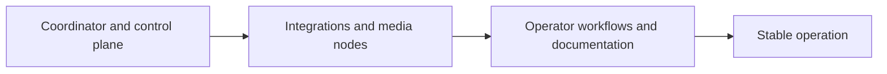

import { Card, CardGrid } from '@astrojs/starlight/components';
import StatusBadge from '../../../components/StatusBadge.astro';
import StatusNote from '../../../components/StatusNote.astro';

ShowMesh is being built so a show can keep running when a control-plane component, UI, integration, or media path has trouble. This page separates usable development features from work that is still in progress.

For the meaning of Available, Experimental, and Planned labels, see [Maturity and complexity](../maturity/).

<StatusNote status="experimental-active" label="v0.2.0 prerelease">

Core and FPP plugin 0.2.0 are published for deliberate show-network testing. The pre-alpha `0.x` line makes no compatibility or migration promise. Later development work is unreleased until a new tag is published.

</StatusNote>

```mermaid
flowchart LR
  A[Coordinator and control plane] --> B[Integrations and media nodes]
  B --> C[Operator workflows and documentation]
  C --> D[Stable operation]
```

## What you can test in v0.2.0

<CardGrid>
  <Card title="Coordinator and operator controls" icon="rocket">
    Released Debian installer and pinned Compose deployment, authenticated MQTT, inventory, observations, API, CLI, Operator UI, principals, audit, backups, and explicit recovery paths. [Install the coordinator →](/getting-started/installation/)
  </Card>
  <Card title="FPP control and observation" icon="puzzle">
    FPP REST/MQTT observation, evidence-confirmed playlist and volume controls, imported playlist definitions, readiness, actions, macros, assets, Shows, Cues, and Playlists. FPP remains the scheduler. [Configure FPP →](/integrations/fpp/)
  </Card>
  <Card title="Resolume Arena control" icon="desktop">
    One Arena instance, composition identity import, observation, supported named actions, and recovery controls. Arena continues to own its composition and mapping. [Configure Arena →](/integrations/resolume/)
  </Card>
  <Card title="Show Mode and emergency stop" icon="warning">
    One installation-wide Program Mode/Show Mode value that subsystems read and react to, and an emergency-stop action every operator surface can reach. [Read Show Mode →](/using-showmesh/show-mode/)
  </Card>
  <Card title="Node installer" icon="setting">
    A scripted native-node install for a Debian 13 host, including systemd unit installation and preflight checks. [Install a native node →](/guides/add-a-node/)
  </Card>
</CardGrid>

## Experimental operating paths

<CardGrid>
  <Card title="Render node and NDI" icon="server">
    <StatusBadge status="experimental-testing" />

    Native render nodes follow the FPP timeline, read node-local FSEQ content, and publish NDI. Several surfaces can share a node with distinct channel ranges and NDI names and matching frame timing. HDMI output is not available. [Set up a video node →](/guides/set-up-a-video-node/)
  </Card>
  <Card title="Audio node" icon="warning">
    <StatusBadge status="experimental-testing" />

    Audio-node software covers configuration, session control, gain/output control, and LTC generation. [Read about audio nodes →](/using-showmesh/node-types/audio-nodes/)
  </Card>
  <Card title="Show Night" icon="open-book">
    <StatusBadge status="experimental-active" />

    Show Night brings together a Show, FPP Playlists, background audio, Transition Steps, and a controlled start/end lifecycle. [Read Show Night →](/using-showmesh/show-night/)
  </Card>
  <Card title="FPP Connect" icon="setting">
    <StatusBadge status="experimental-testing" />

    Native nodes accept experimental xLights FPP Connect content and report channel-range outcomes. [Read the FPP Connect guide →](/integrations/xlights/)
  </Card>
  <Card title="Multi-node audio" icon="warning">
    <StatusBadge status="experimental-active" />

    Cue audio, announcements, Night beds, item changes, and resumes can target several nodes at one shared scheduled instant. Per-node evidence reports aligned or unaligned results. Physical timing, PTP lock, and recovery still need installation acceptance. [Read about audio nodes →](/using-showmesh/node-types/audio-nodes/)
  </Card>
  <Card title="Signed FPP fallback program" icon="puzzle">
    <StatusBadge status="experimental-active" />

    The coordinator builds and signs fallback programs, and the plugin can fetch, verify, install, acknowledge, and locally resolve entries. Coordinator-to-node activation delivery remains incomplete. [Read about FPP →](/integrations/fpp/)
  </Card>
</CardGrid>

## Work toward stable operation

HDMI output and coordinator-to-node signed fallback activation remain unavailable. Broader hardware support, timing acceptance, vendor-version recovery guidance, secure remote deployment, and long-term compatibility still need work.

Use the guides to stage and test a show deliberately, and retain native/manual controls for every show-critical system.
